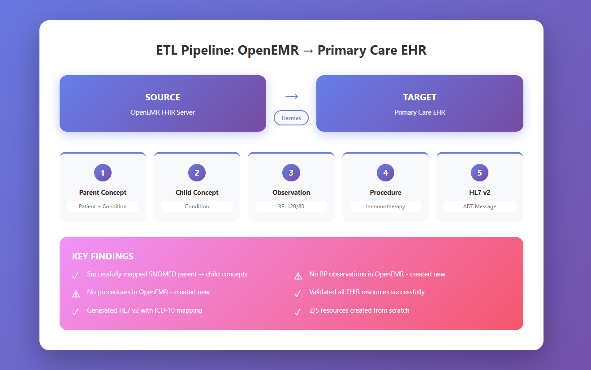

<link rel="stylesheet" href="assets/style.css">

# **About**

[Home](./index.md) ||
[ETL Pipeline](./etl_pipeline.md) ||
[Insights](./insights.md) ||
[Team Contributions](./team_contrib.md) ||
[About](./about.md) ||

---

## About Our Team

We are a three-member team in the **Health Informatics** program at Indiana University Indianapolis.  
This project was completed for the *INFO-B581* final project and focuses on building a small, working ETL pipeline using FHIR, SNOMED CT, ICD-10, and HL7 v2.

**Team members**

- **Poojitha Surgi:** Led ETL coding, refined Python scripts, and managed pipeline data setup.  
- **Chaitra Sammeta:** Developed HL7 scripts, created diagrams, and managed website layout and formatting.  
- **Rashmita Kudamala:** Tested data outputs, debugged tasks, and supported ETL documentation.

---

## Project Context

The goal of this project was to design and implement an **Extract-Transform-Load (ETL)** pipeline that:

- Extracts Patient and clinical data from an **OpenEMR FHIR** server  
- Transforms Condition codes using **SNOMED CT** parent/child concepts and SNOMED => ICD-10 mappings (via **Hermes**)  
- Loads standardized Patient, Condition, Observation, and Procedure resources into a **Primary Care EHR FHIR** server  
- Generates an **HL7 v2 ADT^A01** message from the FHIR data for legacy system interoperability  

[Project Overview](assets/project_flow.html)

---

### Overview of FHIR APIs

**FHIR (Fast Healthcare Interoperability Resources)** is a modern standard for exchanging healthcare information electronically. It provides:

- **RESTful APIs** – Uses standard HTTP methods (GET, POST, PUT, DELETE) making it familiar to web developers
- **Resource-based structure** – Everything is a "resource" (Patient, Condition, Observation, Procedure) with standardized JSON/XML format
- **Interoperability focus** – Designed specifically to enable data exchange between different healthcare systems

FHIR plays a critical role in healthcare data exchange by providing a common language that different EHR systems can use to communicate. Before FHIR, each vendor had proprietary APIs requiring custom integration for every system.

## Technical Setup: APIs & Authentication
Our ETL pipeline communicates with three main services:

- **Source FHIR server (OpenEMR)**  
  `https://in-info-web20.luddy.indianapolis.iu.edu/apis/default/fhir`

- **Destination FHIR server (Primary Care EHR)**  
  `http://159.203.105.138:8080/fhir`

- **Hermes Terminology Server (SNOMED CT)**  
  `http://159.203.121.13:8080/v1/snomed`

Access to the OpenEMR FHIR API requires an OAuth2 access token. The token is stored locally in  
`src/data/access_token.json` and is read by our helper function before each API call.

---

## ETL Pipeline Journey

Our ETL pipeline follows three core stages:

**Extract:** 

We connect to the OpenEMR FHIR server using OAuth2 authentication and retrieve Patient, Condition, Observation, and Procedure resources using FHIR search parameters (e.g., `GET /Patient?name=James&gender=male&birthdate=gt2000-01-01`).

**Transform:**  

The Hermes Terminology Server performs SNOMED CT parent/child concept lookups and SNOMED-to-ICD-10 mappings. We also clean data by removing server-specific IDs, normalizing addresses, and adding required FHIR fields like `clinicalStatus` and `verificationStatus`.

**Load:**  

Transformed resources are validated using the `$validate` operation and then POSTed to the Primary Care EHR FHIR server. Each resource is checked against FHIR profiles before acceptance.

The following interactive visualization shows our complete ETL workflow across all five coding tasks:

[View Interactive Version](./assets/etl_journey.html)

---

**Task 1: Parent Concept ETL**

We pull the patient and condition from OpenEMR, map the condition to a SNOMED **parent** concept, and create the Patient + parent Condition on the Primary FHIR server.

  

**Task 2: Child Concept ETL**

We reuse the same condition code, look up a SNOMED **child** concept in Hermes, and post a second Condition for the same patient on the Primary FHIR server.

  

**Task 3: Observation (Blood Pressure) ETL**

  We search for blood pressure by LOINC `85354-9`, then create a vitals Observation linked to the primary patient and Practitioner/8.

  

**Task 4: Procedure ETL**

 We create a Procedure coded as SNOMED `180256009` (Subcutaneous immunotherapy) and attach it to the same patient, including reason, follow-up, and note.

  

**Task 5: HL7 V2 Message**

  We map the SNOMED diagnosis to ICD-10 using Hermes and build an `ADT_A01` HL7 v2 message (`MSH`, `PID`, `PV1`, `DG1`) from the FHIR data.

  

---

## Key Insights

#### 1. Clinical Data Incompleteness is Common

When exploring the OpenEMR FHIR server for our selected patient (James Russell, ID: `9d036484-c661-485c-899d-fcab43d40914`), we discovered:

- The patient had documented **Conditions** (Allergic rhinitis, SNOMED: 61582004) in the system
- **Zero blood pressure Observations** using LOINC code `85354-9` – we had to create new vitals (BP observation)
- **Zero Procedure resources** – we created a clinically appropriate Subcutaneous immunotherapy procedure (SNOMED: 180256009)

**Critical finding:** **2 out of 5 resources (40%) required creation from scratch** rather than transformation of existing data.

This absence reflects a realistic scenario in healthcare IT: **EHR data completeness varies significantly** based on clinical workflows, documentation practices, and system capabilities. ETL pipelines must be designed to handle missing data gracefully.

#### 2. Standardized Terminologies Enable Interoperability

Using standard vocabularies was essential for our pipeline:

- **SNOMED CT** – Provided consistent representation of conditions and procedures across both FHIR servers (e.g., `61582004` for allergic rhinitis means the same thing everywhere)
- **LOINC** – Enabled straightforward searching for blood pressure observations using a single universal LOINC code (`85354-9`)
- **ICD-10** – Mapped from SNOMED CT via Hermes using refset `447562003`, supporting billing requirements while preserving clinical detail

**Key takeaway:** Terminology standards are central for interoperability

#### 3. FHIR References help Reconstruct Clinical Context

By linking resources through FHIR references, we created a coherent clinical narrative:

- **Diagnosis** (Conditions) documented with SNOMED CT
- **Vitals** (Blood pressure Observation) associated via `subject` reference to patient
- **Treatment** (Procedure for immunotherapy) linked to diagnosis via `reasonCode`

These connections enable EHR systems to display the complete clinical story: **diagnosis → vitals → treatment** – all preserved through standardized FHIR relationships.

---

# Challenges and How We Resolved Them

| Challenge                                 | Issue                                                                                                                                                                       | Resolution                                                                                                                                  |
|-------------------------------------------|-----------------------------------------------------------------------------------------------------------------------------------------------------------------------------|---------------------------------------------------------------------------------------------------------------------------------------------|
| Missing or incomplete clinical data       | Some patients had no Blood pressure (an important vital sign) or Procedure resource in OpenEMR                                                                              | Created a new Observation and Procedure resource in Primary care FHIR server to complete the clinical story                                 |
| FHIR validation warnings                  | The Primary Care EHR FHIR server rejected our initial resources with validation errors: Missing narrative text, invalid identifier type.                                    | Used `$validate` operation during development to catch errors early: Added `meta.profile`, `text.div`, and adjusted identifiers & addresses |
| Data Inconsistencies and Empty Responses  | FHIR search queries sometimes returned bundles without an `entry` field, or with `entry` as an empty array. Attempting to access `data['entry'][0]` would crash the script. | Implemented defensive coding patterns (if 'entry' in data and data['entry']...) to handle errors.                                           |                                 |

---

### Best Practices for FHIR ETL Pipelines

Based on our experience, we recommend these practices:

1. **Validate Early and Often** – Use `$validate` before every POST to catch structural issues during development
2. **Handle Missing Data Gracefully** – Check if fields exist using `.get()` with defaults; decide upfront whether to create, skip, or flag missing data
3. **Use Terminology Services** – Leverage servers like Hermes for SNOMED/ICD-10 mappings rather than hard-coding.
4. **Log All Transactions** – Record every API request, response, and error for debugging and auditing

---

## Closing: Why this ETL pipeline matters and value for Healthcare orgranizations

If we deployed this ETL pipeline in a real healthcare organization, it would add value in several ways:

1. **Operational efficiency**  
   Today, staff often re-enter diagnoses and vitals into multiple systems when patients move between settings. Our pipeline automates that hand-off: extract from one FHIR system, transform with standard codes, and load into another. Even saving ~10 minutes per patient for a modest volume quickly adds up to thousands of staff hours per year.

2. **Clinical safety**  
   Using the same SNOMED CT code for a condition in both systems reduces ambiguity during handoffs. The diagnosis for allergic rhinitis looks identical wherever the patient shows up, which lowers the risk of miscommunication-related errors.

3. **Revenue and documentation quality**  
   Clinics document with SNOMED CT, but billing requires ICD-10. Our SNOMED → ICD-10 mapping via Hermes supports more accurate coding, fewer manual recodes, and cleaner claims.

4. **Legacy system integration**  
   Many existing systems still rely on HL7 v2. By generating an ADT^A01 message from the FHIR data, our pipeline lets organizations adopt modern FHIR APIs without replacing every legacy system on day one.

5. **Analytics and population health**  
   Because we use standardized codes (SNOMED CT, LOINC, ICD-10), it becomes much easier to run population queries such as: “Which patients with allergic rhinitis have no recent blood pressure measurement?” That type of question supports quality improvement and value-based care.

**Bottom line:**  
This project shows that with a relatively small Python-based ETL pipeline, an organization can improve data flow between systems, support safer care, strengthen billing, and prepare for future interoperability requirements.

---

[Conclusion](assets/summary.html)

---
<button id="backToTop" onclick="scrollToTop()">↑</button>

