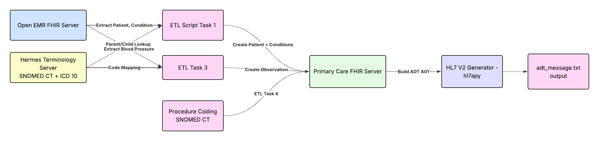

<link rel="stylesheet" href="assets/style.css">

# Clinical Data ETL with FHIR, SNOMED CT, and HL7 v2

[Home](./index.md) ||
[ETL Pipeline](./etl_pipeline.md) ||
[Insights](./insights.md) ||
[Team Contributions](./team_contrib.md) ||
[About](./about.md) ||

---
## Introduction

Welcome to the demonstration website for our **Clinical Data ETL with FHIR, SNOMED CT, and HL7 v2** project.  
We built a small end-to-end ETL **(Extract-Transform-Load)** pipeline to demonstrate how clinical data can move safely and consistently between different healthcare systems.

**The Pipeline:**

- **Extracts** Patient and Condition resources from a source **FHIR** server (OpenEMR)  
- **Transforms** clinical concepts using **SNOMED CT** (parent/child hierarchies and mappings) via the **Hermes Terminology Server**  
- **Loads** standardized Patient, Condition, Observation, and Procedure resources into a destination **FHIR** server (Primary Care EHR)  
- **Generates** a legacy **HL7 v2 ADT^A01** message (using `hl7apy`) from the FHIR data so that non-FHIR systems can consume the same clinical information

---

## Purpose of the ETL pipeline

The purpose of this ETL pipeline is to show how clinical data can be **extracted from one FHIR system, transformed using standard clinical terminologies, and re-loaded into a second FHIR system** while preserving meaning and structure. It illustrates how interoperability standards (**FHIR, SNOMED CT, ICD-10, HL7 v2**), a terminology service (**Hermes**), and Python scripts work together to support consistent, reliable clinical data exchange between modern API-based systems and legacy HL7-based environments.

---

## Key Tools and Technologies

- **FHIR APIs** - OpenEMR (source) and Primary Care EHR (target)  
- **SNOMED CT** - Parent/child concepts and mappings, accessed via the **Hermes Terminology Server**  
- **ICD-10** - Diagnosis coding used in the HL7 DG1 segment  
- **HL7 v2** - ADT^A01 message generation using `hl7apy`  
- **Python** - `requests` for API calls, custom ETL scripts for Tasks 1-5, and a separate validation script  

---

## ETL Pipeline at a Glace

Our implementation is organized into **five coding tasks**, each building on the previous one:

1. **Task 1 - Parent Condition ETL**  
   - Extracts a Patient and their Condition from the OpenEMR FHIR server.  
   - Uses Hermes to look up the **parent SNOMED CT concept** for the Condition.  
   - Cleans the Patient resource (removes SSN, normalizes address) and creates a new Patient + parent Condition (parent concept) on the **Primary Care FHIR server**.  

2. **Task 2 - Child Condition ETL**  
   - Starts from the same Condition and uses Hermes to find a **child SNOMED CT concept** for the condition.  
   - Builds a second Condition (child concept) for the same primary patient, including clinical status, verification status, category, severity, body site, and onset date.  

3. **Task 3 - Observation (Blood Pressure)**  
   - Searches for blood pressure Observations using LOINC `85354-9` on OpenEMR FHIR server.  
   - Creates a structured vital-signs Observation Resource (systolic/diastolic, LOINC + SNOMED codes) linked to the primary patient and `Practitioner/8` when needed.  

4. **Task 4 - Procedure**  
   - Creates a SNOMED-coded Procedure (`180256009 - Subcutaneous immunotherapy`) for the primary patient.  
   - Includes narrative text, performer (`Practitioner/8`), performed date, reason, follow-up, and a clinical note.  

5. **Task 5 - HL7 v2 ADT Message**  
   - Uses the parent Condition and Hermes to map **SNOMED → ICD-10**.  
   - Builds an HL7 v2 `ADT_A01` message (`MSH`, `PID`, `PV1`, `DG1`) from the FHIR data using `hl7apy`.  
   - Exports the message in ER7 format so a legacy system could read and use the same diagnosis and demographics.

For a more detailed, step-by-step description of each task (including Extract/Transform/Load logic and workflow charts), see the **[ETL Pipeline](./etl_pipeline.md)** page.

---

## Summary of the deliverables

Running the pipeline produces the following artifacts:

- **Python scripts** for **Tasks 1-5** and a dedicated **validation script**  
- **FHIR JSON resources**:
  - `patient.json` - Patient resource on the Primary Care FHIR server  
  - `parent_condition.json` - Condition using the **parent SNOMED concept**  
  - `child_condition.json` - Condition using the **child SNOMED concept**  
  - `observation.json` - Blood pressure Observation (LOINC 85354-9)  
  - `procedure.json` - SNOMED-coded Procedure resource  
- **Text files with server-assigned IDs**:
  - `primary_patient_id.txt`, `observation_id.txt`, `procedure_id.txt`   
- **HL7 v2 message output**:
  - `adt_message.txt` - HL7 v2 `ADT^A01` message generated from FHIR data  
- This **GitHub Pages website**, which documents the ETL workflow, key insights, and team contributions

These deliverables together show a complete path from FHIR → terminology transformation → FHIR → HL7 v2.

---

<button id="backToTop" onclick="scrollToTop()">↑</button>

