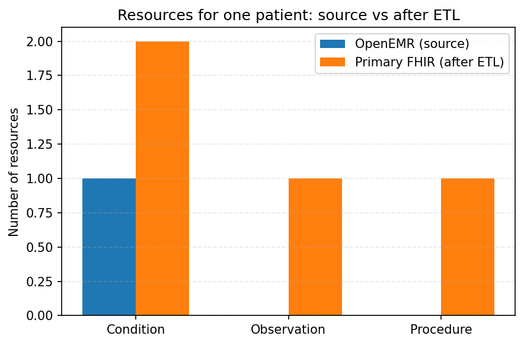

<link rel="stylesheet" href="assets/style.css">

# **Insights**

[Home](./index.md) ||
[ETL Pipeline](./etl_pipeline.md) ||
[Insights](./insights.md) ||
[Team Contributions](./team_contrib.md) ||
[About](./about.md) ||

---

## Overview

This page summarizes what we learned from building and testing the ETL pipeline.  

**It focuses on:** 
- What we observed in the **source FHIR data**  
- Practical **challenges** with APIs, validation, and terminology  
- Key **lessons learned** and **possible next steps**  

---

## Data insights from the FHIR API

### 1. Clinical data are not complete for every patient

When exploring the OpenEMR FHIR server for our selected patient (James Russell), we found:

- The patient had documented Conditions (Perennial rhinitis) but **no existing blood pressure Observations** with LOINC code `85354-9`.
- This required us to create a new BP Observation (120/80 mmHg) for the Primary Care EHR rather than transferring existing data.
- Procedure data were absent in OpenEMR for this patient, so we created a clinically appropriate Procedure (Subcutaneous immunotherapy) to complete the clinical picture.

This absence of vital signs and procedures in the source system reflects a realistic scenario: **EHR data completeness varies significantly**, and ETL pipelines must be prepared to either create missing data structures or handle gaps gracefully.

---

### 2. Standardized codes make querying and reuse much easier

Working with standard terminologies directly affected how simple the code was:

- **SNOMED CT** codes allowed us to represent Conditions and Procedures consistently across both FHIR servers.  
- **LOINC** made it straightforward to search for blood pressure Observations using a single code (`85354-9`) instead of screen labels or free text.  
- Using Hermes to map **SNOMED CT → ICD-10** meant we could reuse the same diagnosis in the HL7 v2 `DG1` segment without manually looking up billing codes.

A clear lesson here is that **terminology services are not optional**. They are central to making the same clinical concept usable across clinical documentation, analytics, and legacy messaging.

---

### 3. Linking Condition, Observation, and Procedure tells a meaningful clinical story

By the end of the pipeline, our primary patient had:

- A **parent Condition** (broader SNOMED CT concept for the diagnosis)  
- A **child Condition** (more specific SNOMED CT concept)  
- A **blood pressure Observation**  
- A **Procedure** for subcutaneous allergen immunotherapy  

All of these resources reference the same Patient through fields such as `subject`, and use elements like `reasonCode`, `bodySite`, and `severity` to add context. Together, they represent a small but clinically meaningful episode that connects diagnosis, treatment, and vital signs rather than isolated entries in the record. This made it easier to see how FHIR relationships can be used to reconstruct a patient’s clinical story in a structured way.

---

## Visualization: Source vs ETL-created resources

To summarize the impact of our pipeline for this single patient, we created a bar chart that compares what was available in OpenEMR with what the ETL pipeline created on the Primary Care FHIR server.

The figure highlights:

* **Conditions**
  * OpenEMR: 1 existing Condition (Allergic rhinitis)
  * ETL: 2 new Conditions (parent and child SNOMED concepts) on the Primary FHIR server

* **Observations**
  * OpenEMR: 0 blood pressure Observations with 85354-9
  * ETL: 1 new Observation created for the primary patient

* **Procedures**
  * OpenEMR: 0 Procedures
  * ETL: 1 new SNOMED-coded Procedure created

Even with only one patient, this visualization reinforces a key insight: the pipeline is not just copying data; it is adding structured clinical content to the target system based on standardized codes.

---

## Challenges and how we addressed them

### 1. Handling empty bundles and HTTP errors

Some FHIR search requests returned bundles **no `entry` element** (e.g., when no Observations matched the query). If we had indexed directly into entry[0], it would lead to index errors.

What we did:

- Added explicit checks such as `if "entry" in data and data["entry"]:` before accessing bundle contents.  
- Printed clear messages such as `"No results found"` when a search returned an empty bundle, instead of failing silently.
- Logged the full request URL so we could quickly see which query produced the issue.

This made the code more defensive and easier to debug when working with real APIs.

---

### 2. FHIR validation and profiles

After generating `patient.json`, `parent_condition.json`, and `child_condition.json`, we used the Primary FHIR server’s `$validate` operation to check conformance.

For the **Patient** resource we consistently saw:

- A *warning* about `Patient.identifier[0].type` not being in the recommended `IdentifierType` value set (we used `http://terminology.hl7.org/CodeSystem/v2-0203#PT`).
- An *information* message about the value set used to validate `Patient.gender`.

For both **Condition** resources, the validator reported:

- `"diagnostics": "No issues detected during validation"` with `severity: "information"`.

Earlier in development, we had “dom-6” best-practice warnings about missing narrative on Condition resources. After we added a simple `text.div` narrative and attached `meta.profile` to both Patient and Condition, those warnings disappeared.

Overall, this helped us get comfortable reading `OperationOutcome` responses and distinguishing between true blocking problems, and warnings that are acceptable but still useful when improving profiles.

---

### 3. Working with Hermes for SNOMED and ICD-10

We relied on the Hermes terminology server for both hierarchy lookups and ICD-10 mapping. The main patterns we used were:
- Parent concept lookup: `>!{snomed_code}`  
- Child concept lookup: `<!{snomed_code}`  
- SNOMED → ICD-10 mapping with refset `447562003`

**What we did:**

- Wrapped this logic into small helper functions (for example, `get_parent_for_code` and `map_snomed_to_icd10` in the code).  
- Reused the same Hermes queries across Tasks 1, 2, and 5 to keep the mapping consistent across the pipeline.
- Printed the full Hermes URL and JSON response when debugging, which helped when a concept did not have a parent or a mapping.

This part of the project showed how terminology servers act as a bridge between clinical concepts and downstream uses like billing codes or HL7 messages.

---

### 4. Building the HL7 v2 ADT message from FHIR JSON

Creating the HL7 v2 `ADT_A01` message in Task 5 required us to:

* Extract demographic and address information from the FHIR Patient.
* Pull the SNOMED code and description from `parent_condition.json`.
* Map SNOMED to ICD-10 and place that in the `DG1` segment.

We used `hl7apy` to build the `MSH`, `PID`, `PV1`, and `DG1` segments and saved the final message as `adt_message.txt`.

This step made it clear how FHIR JSON and HL7 v2 are very different representations of the same clinical story, and how careful you have to be when mapping fields between them.

---

## Lessons learned

Across the full ETL workflow, we mainly learned that:

- It is important to **understand the FHIR resource structure** (Patient, Condition, Observation, Procedure) before writing extraction and transformation code.[^1]  
- **Validating resources early** (using `$validate`) is very helpful; it catches small structural issues before they reach the target system.[^1]  
- **Terminology and coding systems are central to interoperability**. Without SNOMED CT, LOINC, and ICD-10 mappings, the same clinical concept cannot be reused reliably across systems.[^2][^3][^4]  
- Real APIs can return incomplete data or unexpected responses, so basic error handling and null checks are necessary even in a controlled project.
- Visualizing even a small piece of the data (like which resources existed vs were created) makes it easier to explain the value of the pipeline.

---

## Possible improvements

If this pipeline were extended beyond this project, we could:

- Run the ETL scripts on a schedule (for example, nightly) to keep the Primary FHIR server synchronized with OpenEMR.  
- Process a larger set of patients and compare patterns across them (not just a single example).
- Add more data-quality checks, such as flagging missing vitals for patients with certain diagnoses.  
- Capture structured logs of each ETL run (requests, responses, and validation results) to support troubleshooting and auditing.  
- Build additional visualizations that summarize conditions, procedures, or observation trends over time.

---

## Value for a healthcare organization

If this ETL pipeline were deployed in a real healthcare organization, it could add value in several practical ways.

### 1. Operational efficiency

Clinicians and staff often have to re-enter diagnoses, vital signs, and procedures when patients move between clinics or systems. Our pipeline automates that process by extracting data from the source FHIR server, transforming it with standard codes, and loading it into the target FHIR server.  

Even a conservative estimate (around 10 minutes of manual re-entry saved per patient across a moderate daily volume) would translate into thousands of staff hours saved per year. That time can be redirected toward patient care instead of duplicate documentation.

### 2. Clinical safety and consistency

Miscommunication during handoffs is a known patient safety risk. By using the same SNOMED CT code for a condition in both systems (for example, 61582004 for allergic rhinitis), the diagnosis remains consistent wherever the patient is seen.  

In our pipeline, the same clinical concept is reused in:
- The Condition resources on the Primary Care FHIR server  
- The SNOMED → ICD-10 mapping step  
- The HL7 v2 DG1 segment in the ADT message  

This reduces ambiguity and supports safer, more consistent clinical information exchange.

### 3. Documentation and billing support

Clinical systems often document with SNOMED CT, while billing workflows require ICD-10. Manually translating between these can be slow and error-prone. Our pipeline uses Hermes to automatically map SNOMED CT concepts to ICD-10 codes using the WHO-maintained refset.  

This type of automation can:
- Improve the accuracy of coded diagnoses  
- Reduce the need for manual rework  
- Support a higher clean-claims rate and smoother revenue cycle processes  

Even small improvements in coding accuracy can have a noticeable impact on reimbursement and denial rates over a year.

### 4. Bridging FHIR and legacy HL7 v2 systems

Many organizations still rely on legacy systems that only accept HL7 v2 messages (for example, older registration, lab, or radiology systems). Our project shows how to generate an HL7 v2 ADT^A01 message from FHIR JSON using `hl7apy`.  

This means that:
- New FHIR-based applications can be introduced without immediately replacing older HL7 v2 systems  
- The same patient and diagnosis information can be shared across both modern and legacy interfaces  

This type of bridge supports gradual modernization instead of “rip and replace” projects.

### 5. Enabling analytics and population health

Because the ETL pipeline uses standardized terminologies (SNOMED CT, LOINC, ICD-10), it becomes easier to run population-level queries. For example, an organization could ask:

> “Show all patients with allergic rhinitis (SNOMED CT: 61582004) who do not have a recent blood pressure Observation (LOINC: 85354-9).”

Queries like this are important for identifying care gaps, tracking quality measures, and supporting value-based care and population health management.

---

### Version control and collaboration with Git

We used Git and GitHub to keep the project organized while all three of us were changing code and website files. Making small, frequent commits with clear messages (for example, after fixing a validation issue or updating a diagram) made it easier to see what changed and to roll back if something broke. Using `.gitignore` to exclude the virtual environment and access-token files also reinforced how version control and basic security go together when working with FHIR APIs.

---

## References

[^1]: HL7 International. *FHIR Release 4 (Fast Healthcare Interoperability Resources)*. Available at: https://www.hl7.org/fhir/  
[^2]: SNOMED International. *SNOMED CT – Global Clinical Terminology*. Available at: https://www.snomed.org/snomed-ct  
[^3]: Regenstrief Institute. *LOINC – Logical Observation Identifiers Names and Codes*. Available at: https://loinc.org  
[^4]: HL7 International. *Version 2.x Messaging Standard (including ADT messages)*. Available at: https://www.hl7.org/implement/standards/product_section.cfm?section=13

---

<button id="backToTop" onclick="scrollToTop()">↑</button>
